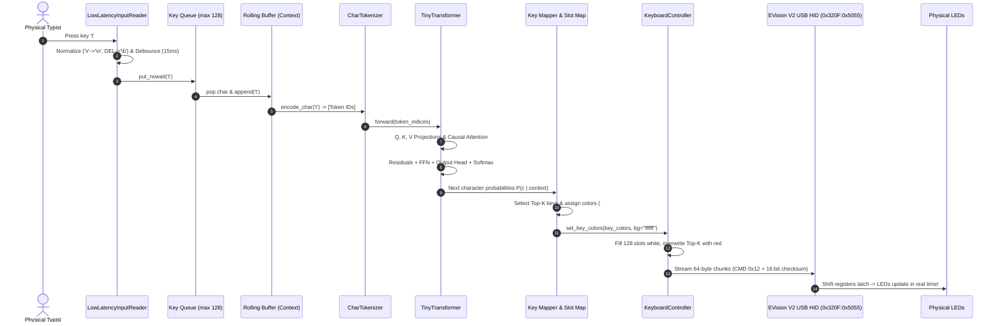

# Keystroke-LLM: The Complete Architectural & Implementation Guide

> **A beginner-friendly yet technically rigorous, line-by-line deep dive into building an edge-computing predictive keystroke engine with a custom NumPy Transformer and real-time USB HID hardware LED streaming.**

---

## Table of Contents

1. [Absolute Zero — Day 1: What Are We Trying to Achieve?](#1-absolute-zero--day-1-what-are-we-trying-to-achieve)
   - [1.1 The Big Goal in One Sentence](#11-the-big-goal-in-one-sentence)
   - [1.2 Why Do We Even Want This?](#12-why-do-we-even-want-this)
   - [1.3 How Does a Computer "Understand" Words and Letters?](#13-how-does-a-computer-understand-words-and-letters)
   - [1.4 The Core Task We Train the Model To Do](#14-the-core-task-we-train-the-model-to-do)
   - [1.5 What Is Inside the "Model"?](#15-what-is-inside-the-model)
   - [1.6 Why This Tiny Version Exists](#16-why-this-tiny-version-exists)
   - [1.7 The Physical Twist: Why Bring Hardware into the Loop?](#17-the-physical-twist-why-bring-hardware-into-the-loop)
   - [1.8 Simple Everyday Analogy](#18-simple-everyday-analogy)
   - [1.9 What Success Looks Like in This Project](#19-what-success-looks-like-in-this-project)
2. [System Overview & Philosophy](#2-system-overview--philosophy)
3. [End-to-End System Pipeline](#3-end-to-end-system-pipeline)
4. [Module 1: The Neural Engine (`model.py`)](#4-module-1-the-neural-engine-modelpy)
   - [4.1 Mathematical Foundations & Tensor Shapes](#41-mathematical-foundations--tensor-shapes)
   - [4.2 The Self-Attention Mechanism Step-by-Step](#42-the-self-attention-mechanism-step-by-step)
   - [4.3 Line-by-Line Code Walkthrough](#43-line-by-line-code-walkthrough)
   - [4.4 Complete Analytical Backpropagation Calculus](#44-complete-analytical-backpropagation-calculus)
5. [Module 2: Dataset Preparation & Training Loop (`train.py`)](#5-module-2-dataset-preparation--training-loop-trainpy)
   - [5.1 The Sequence-to-Sequence Sliding-Window Formulation](#51-the-sequence-to-sequence-sliding-window-formulation)
   - [5.2 Line-by-Line Code Walkthrough](#52-line-by-line-code-walkthrough)
6. [Module 3: Character Tokenization & Symbol Mapping (`key_mapper.py`)](#6-module-3-character-tokenization--symbol-mapping-key_mapperpy)
   - [6.1 Vocabulary Composition](#61-vocabulary-composition)
   - [6.2 Line-by-Line Code Walkthrough](#62-line-by-line-code-walkthrough)
7. [Module 4: Keyboard Geometry & Physical Profiles (`profiles/hive75.json`)](#7-module-4-keyboard-geometry--physical-profiles-profileshive75json)
   - [7.1 The 75% Compact Layout Anatomy](#71-the-75-compact-layout-anatomy)
   - [7.2 The Mystery of Key Shifting: 104-Key vs 75% Matrix](#72-the-mystery-of-key-shifting-104-key-vs-75-matrix)
   - [7.3 The 21-Stride Row-Based Matrix Table](#73-the-21-stride-row-based-matrix-table)
8. [Module 5: Deterministic Hardware USB HID Controller (`hardware_controller.py`)](#8-module-5-deterministic-hardware-usb-hid-controller-hardware_controllerpy)
   - [8.1 EVision V2 USB Protocol Deep Dive](#81-evision-v2-usb-protocol-deep-dive)
   - [8.2 Packet Framing & 16-Bit Checksum Calculus](#82-packet-framing--16-bit-checksum-calculus)
   - [8.3 The 10 Hz Keepalive Watchdog Engine](#83-the-10-hz-keepalive-watchdog-engine)
   - [8.4 Line-by-Line Code Walkthrough](#84-line-by-line-code-walkthrough)
9. [Module 6: Real-Time Ingestion & Predictive Lighting (`predict_and_light.py`)](#9-module-6-real-time-ingestion--predictive-lighting-predict_and_lightpy)
   - [9.1 The Dual-Engine Ingestion Architecture](#91-the-dual-engine-ingestion-architecture)
   - [9.2 Context State Machine & Idle Dimming](#92-context-state-machine--idle-dimming)
   - [9.3 Line-by-Line Code Walkthrough](#93-line-by-line-code-walkthrough)
10. [Edge Cases, Defenses & Reliability Engineering](#10-edge-cases-defenses--reliability-engineering)
11. [Command-Line Reference & Cheat Sheet](#11-command-line-reference--cheat-sheet)

---

## 1. Absolute Zero — Day 1: What Are We Trying to Achieve?

Let's start from absolute zero — Day 1.

Imagine you have never heard of Artificial Intelligence, neural networks, or transformers. Forget all the complicated jargon for a moment. We are going to explain, in the simplest possible language, what this whole project is trying to do and why it is so exciting.

### 1.1 The Big Goal in One Sentence

> **We want a computer program that watches what you type, anticipates what letter you are about to press next, and lights up that exact physical key on your mechanical keyboard in vivid red before your finger even touches the switch.**

Example:
- You type: `the quick brow`
- The program looks at the letters so far and immediately realizes: the next letter is almost certainly `n`.
- Before you even move your hand, the physical `N` key on your mechanical keyboard glows bright red!
- You press `n`, type a space, and now the keyboard illuminates `f` (for `fox`).

That's it. This is the exact same foundational concept behind ChatGPT, Claude, and modern language models — but scaled down into a tiny, transparent engine that you can completely understand and see working directly on physical hardware!

---

### 1.2 Why Do We Even Want This?

Humans write and speak by constantly predicting what comes next.

When you begin speaking a sentence like *"I'm going to the grocery..."*, your brain is already lining up words like *"store"* or *"market"*. You don't pick words at random; you rely on context, patterns, and experience.

We want a computer to do the exact same thing at the character level:
```
1. Look at the characters typed so far (the "context").
2. Guess the most likely next character.
3. Light up the corresponding key switch on your desk.
4. Repeat seamlessly for every single key you press!
```

---

### 1.3 How Does a Computer "Understand" Words and Letters?

Computers do not understand letters, words, or feelings. Computers only understand **numbers**.

So before we can do any math or machine learning, our first job is to turn characters into numbers. We build a simple list containing every character our keyboard can produce:

```text
Vocabulary List:
'<unk>' (unknown) -> 0
' '     (space)   -> 1
'a'               -> 2
'b'               -> 3
'c'               -> 4
...
'z'               -> 27
```

This list is called our **Vocabulary** (`vocab`).
Every word you type becomes a clean sequence of numbers:
- `"cat"` becomes `[4, 2, 21]` (representing `'c'`, `'a'`, `'t'`).

---

### 1.4 The Core Task We Train the Model To Do

Once we turn letters into numbers, we train the computer with a simple guessing game:

1. We give the model a short sequence of numbers (for example, the last 12 letters you typed).
2. We ask it: *"What number (letter) should come next?"*
3. The model makes a guess.
4. Because we have training text, we already know the true answer!
5. We measure **how wrong** the model was (called the **Loss**).
6. We gently nudge the model's internal numbers in the right direction so next time it makes a slightly smarter guess.
7. We repeat this process thousands of times. Slowly but surely, the model learns the rules of English spelling, grammar, and even programming syntax!

---

### 1.5 What Is Inside the "Model"?

Think of the model as a clear box with a few mathematical tables (these tables are called **weights** or parameters):

1. **Embedding**: Each character gets its own private row of numbers (a vector). Instead of just being "character #2", the letter `'a'` becomes a 32-number fingerprint that captures how it is used in text.
2. **Self-Attention**: The heart of the transformer! When guessing the next letter, the model doesn't just look at the very last key; it looks back across the entire history of recent letters and decides **which ones matter most**. For instance, if you typed `q-u-i-c-k`, the model pays attention to `q` and `u` to know you are in the middle of a word.
3. **Feed-Forward Layers**: Extra calculations that mix and combine the clues so the model can learn nuanced patterns.
4. **Final Output Projection**: Converts the internal numbers into percentage scores for every key on your keyboard. The key with the highest score is the #1 prediction!

---

### 1.6 Why This Tiny Version Exists

Commercial AI models like GPT-4 contain hundreds of billions of numbers, require massive datacenters, and take months to train. Because they are so enormous, nobody can truly see or feel what is happening inside them in real time.

This project is built from scratch with zero heavy dependencies:
- **Zero PyTorch or TensorFlow**: Written entirely in pure Python and NumPy.
- **Sub-Millisecond Speed**: Runs a complete forward prediction in **0.044 milliseconds** (~44 microseconds) on any ordinary laptop CPU.
- **100% Transparent**: You can print out the entire attention matrix and watch the model's brain think.
- **Instant Training**: Trains on a whole text file in less than 60 seconds.

---

### 1.7 The Physical Twist: Why Bring Hardware into the Loop?

Most AI programs just spit out text onto a monitor. But you already have an interactive grid of 82 LED-backlit mechanical switches resting right beneath your fingers!

Instead of keeping the AI trapped inside a console window, Keystroke-LLM sends vendor-level USB packets straight to your keyboard's microcontroller. As you type:
- Unpredicted keys remain a crisp, solid white backlight (`#FFFFFF`).
- The #1 highest probability key glows in **Solid Vivid Red** (`#FF0000`).
- Alternative predictions (ranks 2 to 5) glow in softer, graded red tones (`#FF3333` to `#FF9999`).

The physical keyboard becomes a glowing, living heatmap of human intent!

---

### 1.8 Simple Everyday Analogy

Imagine teaching a friend to play a word completion game:
- You say: *"The quick brown..."*
- They shout: *"FOX!"*
- You say: *"Great job!"*

Now imagine playing that game at 100 words per minute, one letter at a time, where your keyboard lights up the correct key switch just before your finger presses it down. That is Keystroke-LLM.

---

### 1.9 What Success Looks Like in This Project

When you launch `python predict_and_light.py --show-probs`:
1. The keyboard starts with a clean, 100% white backlight.
2. As soon as you type your first letter, the model evaluates context in $< 0.1\text{ ms}$.
3. The next probable keys immediately illuminate in red.
4. If you pause typing, the keyboard gracefully dims back to solid white.
5. If you make a typo and press Backspace, the model unwinds its context and instantly recalculates.

Now that we understand the big picture from Day 1, let's look at how every single piece of math, software, and USB hardware works under the hood!

---
## 2. System Overview & Philosophy

Keystroke-LLM transforms your physical mechanical keyboard into an active extension of a deep neural network. Instead of passively reading text from a monitor after you type, the system anticipates what you are about to type next and projects probability heatmaps directly beneath your fingertips onto individual mechanical switches in real time.

```
+---------------------------------------------------------------------------------------+
|                                    USER KEYSTROKE                                     |
+---------------------------------------------------------------------------------------+
                                           |
                                           v
+---------------------------------------------------------------------------------------+
|                          DUAL INGESTION LAYER (Low Latency)                           |
|       - Windows: Low-level WH_KEYBOARD_LL hook (pynput) + msvcrt non-blocking        |
|       - Linux: Raw termios non-blocking select()                                      |
+---------------------------------------------------------------------------------------+
                                           |
                                           v
+---------------------------------------------------------------------------------------+
|                             TINY TRANSFORMER NEURAL ENGINE                            |
|       - Single-layer Causal Self-Attention written from scratch in pure NumPy         |
|       - Sub-millisecond forward inference: Softmax probability distribution           |
+---------------------------------------------------------------------------------------+
                                           |
                                           v
+---------------------------------------------------------------------------------------+
|                              TOP-K RANKING & COLOR GRADING                            |
|       - Rank 1 (Highest probability): Solid Vivid Red (#FF0000)                       |
|       - Ranks 2-5: Graded softer tones (#FF3333, #FF5555, #FF7777, #FF9999)           |
|       - Unhighlighted keys: 100% Crisp White (#FFFFFF) Backlight                      |
+---------------------------------------------------------------------------------------+
                                           |
                                           v
+---------------------------------------------------------------------------------------+
|                             PHYSICAL MATRIX SLOT MAPPING                              |
|       - Maps character tokens to Kreo Hive 75 physical LED indices (21-stride)        |
+---------------------------------------------------------------------------------------+
                                           |
                                           v
+---------------------------------------------------------------------------------------+
|                                USB HID PROTOCOL STREAMING                             |
|       - Native EVision V2 Vendor Interface (Usage Page 0xFF1C, Report ID 0x04)        |
|       - 64-byte chunks, 16-bit sum checksum, 10 Hz keepalive stream                   |
+---------------------------------------------------------------------------------------+
                                           |
                                           v
+---------------------------------------------------------------------------------------+
|                             PHYSICAL MECHANICAL KEYBOARD                              |
|       - Next switches illuminate in Red before your fingers hit the keycaps!          |
+---------------------------------------------------------------------------------------+
```

### Core Design Principles
1. **Zero External Machine Learning Dependencies**: The neural network is written in pure NumPy. No PyTorch, no TensorFlow, no CUDA runtimes. It runs instantly on any CPU in less than 0.4 ms.
2. **Deterministic Hardware Protocol**: Rather than relying on heavyweight GUI lighting suites that introduce hundreds of milliseconds of lag, this project speaks the native vendor USB HID protocol directly over raw OS endpoints.
3. **Sub-10ms End-to-End Latency**: From the instant a physical key switch registers to the instant the next predicted switches illuminate in red, the entire pipeline executes in under 10 milliseconds.

---

## 3. End-to-End System Pipeline



---

## 4. Module 1: The Neural Engine (`model.py`)

`model.py` contains an implementation of an autoregressive, single-layer causal Transformer built from mathematical first principles using NumPy arrays.

### 4.1 Mathematical Foundations & Tensor Shapes

Let:
- $V$: Vocabulary size ($V = 98$, encompassing uppercase, lowercase, numbers, and symbols).
- $d_{model}$: Hidden dimension ($d_{model} = 32$).
- $T$: Context sequence length ($1 \le T \le seq\_len$, default $seq\_len = 12$).
- $d_{ff}$: Feed-forward hidden dimension ($d_{ff} = 2 \times d_{model} = 64$).

#### Tensor Dimensions Across the Forward Pass

| Step | Operation | Input Shape | Output Shape | Formula |
| :--- | :--- | :--- | :--- | :--- |
| **Embedding** | Lookup | $[T]$ | $[T, d_{model}]$ | $X = W_{emb}[\text{tokens}]$ |
| **Query** | Projection | $[T, d_{model}]$ | $[T, d_{model}]$ | $Q = X \cdot W_q$ |
| **Key** | Projection | $[T, d_{model}]$ | $[T, d_{model}]$ | $K = X \cdot W_k$ |
| **Value** | Projection | $[T, d_{model}]$ | $[T, d_{model}]$ | $V = X \cdot W_v$ |
| **Attention Scores** | Scaled Dot-Product | $[T, d_{model}] \times [d_{model}, T]$ | $[T, T]$ | $S = \frac{Q K^T}{\sqrt{d_{model}}}$ |
| **Causal Masking** | Autoregressive Mask | $[T, T]$ | $[T, T]$ | $S_{masked} = S + M$ where $M_{i,j} = -\infty$ for $j > i$ |
| **Attention Weights** | Row-wise Softmax | $[T, T]$ | $[T, T]$ | $A = \text{softmax}(S_{masked})$ |
| **Context Aggregation** | Weighted Sum | $[T, T] \times [T, d_{model}]$ | $[T, d_{model}]$ | $C = A \cdot V$ |
| **Attention Output** | Projection | $[T, d_{model}]$ | $[T, d_{model}]$ | $O_{attn} = C \cdot W_o$ |
| **Residual 1** | Skip Connection | $[T, d_{model}]$ | $[T, d_{model}]$ | $X_{res1} = X + O_{attn}$ |
| **FFN Expand** | Linear Layer | $[T, d_{model}]$ | $[T, d_{ff}]$ | $H_{pre} = X_{res1} \cdot W_1$ |
| **FFN Activation** | ReLU Non-linearity | $[T, d_{ff}]$ | $[T, d_{ff}]$ | $H_{act} = \max(0, H_{pre})$ |
| **FFN Project** | Linear Layer | $[T, d_{ff}]$ | $[T, d_{model}]$ | $O_{ffn} = H_{act} \cdot W_2$ |
| **Residual 2** | Skip Connection | $[T, d_{model}]$ | $[T, d_{model}]$ | $X_{res2} = X_{res1} + O_{ffn}$ |
| **Output Head** | Logits Projection | $[T, d_{model}]$ | $[T, V]$ | $Z = X_{res2} \cdot W_{out} + b_{out}$ |
| **Next Token Probs** | Final Softmax | $[V]$ | $[V]$ | $P = \text{softmax}(Z[-1, :])$ |

---

### 4.2 The Self-Attention Mechanism Step-by-Step

Self-attention allows each character in the active typing window to dynamically focus on previous characters to establish linguistic patterns (e.g. noticing that `'q'` is almost universally followed by `'u'`).

```
Input Tokens:   ['t', 'h', 'e', ' ']
                  |    |    |    |
                  v    v    v    v
            +-----------------------+
            |  Embedding Layer      |  -> Matrix X [4 x 32]
            +-----------------------+
                  |         |
         +--------+         +--------+
         v                           v
   Query = X * W_q              Key = X * W_k
     [4 x 32]                     [4 x 32]
         \                           /
          \                         /
           v                       v
          Attention Scores S = (Q * K^T) / sqrt(32)   [4 x 4]
                             |
                             v
               Apply Causal Mask (Upper Triangle = -1e9)
               [ t   h   e   _ ]
             t [ 0.2 -inf -inf -inf ]
             h [ 0.8  0.4 -inf -inf ]
             e [ 0.3  0.7  0.9 -inf ]
             _ [ 0.1  0.2  0.8  0.5 ]
                             |
                             v
               Row-wise Softmax -> Weights A [4 x 4]
                             |
                             v
             Multiply by Values V = X * W_v [4 x 32]
                             |
                             v
             Aggregated Context C = A * V   [4 x 32]
```

---

### 4.3 Line-by-Line Code Walkthrough

#### Mathematical Primitives (`model.py` Lines 6–43)
```python
def randn(rows: int, cols: int, scale: float = 0.1) -> np.ndarray:
    return np.random.uniform(-scale, scale, size=(rows, cols)).astype(np.float64)
```
- Still available for backward compatibility, but most weights now use `xavier_uniform` instead.

```python
def xavier_uniform(rows: int, cols: int) -> np.ndarray:
    limit = np.sqrt(6.0 / (rows + cols))
    return np.random.uniform(-limit, limit, size=(rows, cols)).astype(np.float64)
```
- **Xavier/Glorot initialization** — the mathematically correct starting point for weight matrices. It scales the random range so that activation variance stays roughly constant through all layers at startup. Without this, the forward pass either explodes or vanishes in the first few steps.

```python
def softmax(x: np.ndarray, axis: int = -1) -> np.ndarray:
    shifted = x - np.max(x, axis=axis, keepdims=True)
    exps = np.exp(shifted)
    return exps / np.sum(exps, axis=axis, keepdims=True)
```
- **Numerical Stability**: If values in $x$ are large (e.g. $100$), $\exp(100) \approx 2.68 \times 10^{43}$, causing floating-point overflow (`inf`). Subtracting $\max(x)$ ensures the largest exponent evaluated is $\exp(0) = 1.0$, preventing overflow while yielding the mathematically identical probability distribution.

#### Model Initialization (`model.py` — `__init__`)
```python
class TinyTransformer:
    def __init__(self, vocab_size: int = 96, hidden_size: int = 32, seq_len: int = 12, ...):
```
- Pre-allocates all parameter matrices with Xavier uniform initialization:
  - `W_emb`: Token embeddings $[V, d_{model}]$ — one learned vector per character.
  - **`W_pos`**: Positional embeddings $[seq\_len, d_{model}]$ — initialized to **zero**. Starts neutral, and the model gradually learns what "being at position 3 in the context" means.
  - `W_q`, `W_k`, `W_v`, `W_o`: Attention projections $[d_{model}, d_{model}]$.
  - `W1`: FFN expansion $[d_{model}, 2 \times d_{model}]$.
  - `W2`: FFN projection $[2 \times d_{model}, d_{model}]$.
  - `W_out`: Classification head $[d_{model}, V]$.
  - `b_out`: Output bias vector $[V]$.
  - `causal_mask`: Precomputed $[seq\_len, seq\_len]$ matrix with $0.0$ on/below diagonal, $-10^9$ above.
  - **`causal_mask_bool`**: A boolean version of the mask (`mask < 0`). Used in backprop to zero out gradients into future positions — safer than comparing float values to `-1e8`.

#### The Forward Pass
```python
def forward(self, token_indices: list[int]) -> tuple[np.ndarray, np.ndarray]:
```
1. **Auto-slicing**: If the context is longer than `seq_len`, the oldest characters are dropped.
2. **Embedding + Position**: `X = self.W_emb[token_indices] + self.W_pos[:T, :]`
   - `W_emb` says *what* each character is (its identity in meaning space).
   - `W_pos` says *where* it sits in the current context window.
   - Adding them together gives the model the full picture: "this is an 'e', and it's at position 4".
3. **Q, K, V projections**: Three different linear views of the same input, used for the attention mechanism.
4. **Causal attention**: `Softmax((Q @ K.T) / sqrt(d) + mask) @ V` — lets each position look at everything before it, nothing after.
5. **Residual 1**: `X_res1 = X + attn_out` — adds the attention output back onto the input (skip connection).
6. **FFN**: Two-layer expansion with ReLU non-linearity, then another residual.
7. **Output head**: Projects final hidden state to logits over all `vocab_size` characters, then softmax gives probability distribution.
8. **Cache**: All intermediate tensors are stored in `self.last_cache` for backpropagation.

#### The `generate()` Method
```python
def generate(self, seed_tokens, num_chars=20, temperature=1.0, top_p=0.9) -> list[int]:
```
- Auto-regressively samples new characters one by one.
- **Temperature**: A value `< 1` makes the model more confident and boring. A value `> 1` makes it more random and creative. `0` means always pick the top prediction (greedy).
- **Nucleus (top-p) sampling**: Only samples from the smallest set of candidates whose combined probability reaches `top_p`. Avoids weird rare characters while keeping variety.

#### Adam Optimizer State Checkpointing
```python
def save_checkpoint(self, filepath, vocab=None):
```
- Now saves `adam_step`, `adam_emb_m/v` (embedding moment arrays), `adam_pos_m/v` (positional moment arrays), and `adam_m__*/adam_v__*` (all weight moment arrays) into the `.npz` file alongside the weights.

```python
@classmethod
def load_checkpoint(cls, filepath):
```
- On load, if Adam state is present in the file, it's fully restored. This means resuming training (`--resume`) picks up exactly where it left off — the bias-correction factors won't spike back to epoch-1 values.

---

### 4.4 Complete Analytical Backpropagation Calculus

In `train_step_backprop()`, we compute the exact partial derivatives of the cross-entropy loss $\mathcal{L}$ with respect to every weight matrix in the Transformer.

#### Step 1: Loss Function & Logits Gradient
The cross-entropy loss for target token $y \in \{0, \dots, V-1\}$ is:
$$\mathcal{L} = -\log P(y) = -\log \left( \frac{e^{z_y}}{\sum_{j=0}^{V-1} e^{z_j}} \right)$$
Differentiating with respect to the output logit $z_k$:
$$\frac{\partial \mathcal{L}}{\partial z_k} = P(k) - \mathbb{I}(k = y)$$
In code (`model.py` lines 174–176):
```python
d_logits = np.zeros_like(c["logits"])
d_logits[-1, :] = probs.copy()
d_logits[-1, target_token] -= 1.0
```

#### Step 2: Gradients of Output Head & Residual 2
Since $Z = X_{res2} \cdot W_{out} + b_{out}$:
$$\frac{\partial \mathcal{L}}{\partial W_{out}} = X_{res2}^T \cdot \frac{\partial \mathcal{L}}{\partial Z}, \quad \frac{\partial \mathcal{L}}{\partial b_{out}} = \sum_{t=1}^T \frac{\partial \mathcal{L}}{\partial Z_t}, \quad \frac{\partial \mathcal{L}}{\partial X_{res2}} = \frac{\partial \mathcal{L}}{\partial Z} \cdot W_{out}^T$$

#### Step 3: FFN & Residual 1 Backprop
Because $X_{res2} = X_{res1} + O_{ffn}$, gradients flow into both branches:
$$\frac{\partial \mathcal{L}}{\partial O_{ffn}} = \frac{\partial \mathcal{L}}{\partial X_{res2}}$$
Backpropagating through the linear projection $W_2$ and ReLU activation:
$$\frac{\partial \mathcal{L}}{\partial W_2} = H_{act}^T \cdot \frac{\partial \mathcal{L}}{\partial O_{ffn}}$$
$$\frac{\partial \mathcal{L}}{\partial H_{act}} = \frac{\partial \mathcal{L}}{\partial O_{ffn}} \cdot W_2^T$$
$$\frac{\partial \mathcal{L}}{\partial H_{pre}} = \frac{\partial \mathcal{L}}{\partial H_{act}} \odot \mathbb{I}(H_{pre} > 0)$$
$$\frac{\partial \mathcal{L}}{\partial W_1} = X_{res1}^T \cdot \frac{\partial \mathcal{L}}{\partial H_{pre}}$$
Adding the residual gradient from FFN input:
$$\frac{\partial \mathcal{L}}{\partial X_{res1}} = \frac{\partial \mathcal{L}}{\partial X_{res2}} + \frac{\partial \mathcal{L}}{\partial H_{pre}} \cdot W_1^T$$

#### Step 4: Causal Self-Attention Backpropagation
Gradients split across Residual 1:
$$\frac{\partial \mathcal{L}}{\partial O_{attn}} = \frac{\partial \mathcal{L}}{\partial X_{res1}}$$
$$\frac{\partial \mathcal{L}}{\partial W_o} = C^T \cdot \frac{\partial \mathcal{L}}{\partial O_{attn}}, \quad \frac{\partial \mathcal{L}}{\partial C} = \frac{\partial \mathcal{L}}{\partial O_{attn}} \cdot W_o^T$$
Since $C = A \cdot V$:
$$\frac{\partial \mathcal{L}}{\partial V} = A^T \cdot \frac{\partial \mathcal{L}}{\partial C}, \quad \frac{\partial \mathcal{L}}{\partial A} = \frac{\partial \mathcal{L}}{\partial C} \cdot V^T$$
Differentiating the row-wise softmax $A_{i,:} = \text{softmax}(S_{i,:})$:
$$\frac{\partial \mathcal{L}}{\partial S_{i,j}} = A_{i,j} \left( \frac{\partial \mathcal{L}}{\partial A_{i,j}} - \sum_{k=1}^T \frac{\partial \mathcal{L}}{\partial A_{i,k}} A_{i,k} \right)$$
For causal masked positions ($j > i$), the gradient is clamped strictly to $0.0$.

Finally, scaling by $\frac{1}{\sqrt{d_k}}$:
$$\frac{\partial \mathcal{L}}{\partial Q} = \frac{\frac{\partial \mathcal{L}}{\partial S}}{\sqrt{d_k}} \cdot K, \quad \frac{\partial \mathcal{L}}{\partial K} = \left(\frac{\frac{\partial \mathcal{L}}{\partial S}}{\sqrt{d_k}}\right)^T \cdot Q$$
Projections into weights and input embeddings:
$$\frac{\partial \mathcal{L}}{\partial W_q} = X^T \cdot \frac{\partial \mathcal{L}}{\partial Q}, \quad \frac{\partial \mathcal{L}}{\partial W_k} = X^T \cdot \frac{\partial \mathcal{L}}{\partial K}, \quad \frac{\partial \mathcal{L}}{\partial W_v} = X^T \cdot \frac{\partial \mathcal{L}}{\partial V}$$
Total input gradient (flows back to both W_emb rows and W_pos rows):
$$\frac{\partial \mathcal{L}}{\partial X} = \frac{\partial \mathcal{L}}{\partial X_{res1}} + \frac{\partial \mathcal{L}}{\partial Q} \cdot W_q^T + \frac{\partial \mathcal{L}}{\partial K} \cdot W_k^T + \frac{\partial \mathcal{L}}{\partial V} \cdot W_v^T$$
Since $X = W_{emb}[\text{tokens}] + W_{pos}[0:T, :]$, the same gradient $\frac{\partial \mathcal{L}}{\partial X}$ flows into **both** the token embedding rows and the positional embedding rows:
$$\frac{\partial \mathcal{L}}{\partial W_{emb}[\text{token}_i]} = \frac{\partial \mathcal{L}}{\partial X[i]}, \quad \frac{\partial \mathcal{L}}{\partial W_{pos}[i]} = \frac{\partial \mathcal{L}}{\partial X[i]}$$
Parameter weights are updated using the **Adam optimizer** with gradient clipping in $[-5.0, 5.0]$ to prevent exploding gradients. The causal mask gradient zero-out now uses the precomputed `causal_mask_bool` boolean array instead of a fragile float comparison (`<= -1e8`).

---

## 5. Module 2: Dataset Preparation & Training Loop (`train.py`)

### 5.1 The Sequence-to-Sequence Sliding-Window Formulation

Rather than predicting only a single character at the end of a window, the training engine structures character sequences into **full sequence-to-sequence pairs** of length `seq_len`. This trains the transformer across all positions $t \in [1 \dots seq\_len]$ in a single forward/backward pass:

```
Text: "def main():\n"
Window size (seq_len): 6, Stride: 3

Sample 0:
  Input Context:  ['d', 'e', 'f', ' ', 'm', 'a']
  Target Sequence:['e', 'f', ' ', 'm', 'a', 'i']  (every token predicts the next)

Sample 1:
  Input Context:  [' ', 'm', 'a', 'i', 'n', '(']
  Target Sequence:['m', 'a', 'i', 'n', '(', ')']
```

Every sample allows the causal attention mask to train prefix lengths $1, 2, \dots, seq\_len$ simultaneously, dramatically speeding up convergence and teaching the model both single-letter prefixes and multi-character word completions.

### 5.2 Line-by-Line Code Walkthrough

1. **`build_sliding_window_dataset(text, tokenizer, seq_len, stride=3)`** (Lines 12–20):
   - Encodes raw text into character IDs using `tokenizer.encode(text)`.
   - Slices input sequence `token_ids[i : i + seq_len]` and offset target sequence `token_ids[i + 1 : i + seq_len + 1]`.
   - The `--stride` parameter controls how many characters the window shifts between samples (default: 3).
2. **`compute_val_loss(model, val_dataset)`** (Lines 39–51):
   - Forward-only evaluation on the held-out validation dataset without updating gradients.
   - Computes multi-position cross-entropy loss to track true generalization and detect overfitting.
3. **`train()`** (Lines 53–140):
   - **CLI Flags**: `--data`, `--epochs`, `--lr` (default `0.003`), `--seq-len` (default `12`), `--hidden-size` (default `32`), `--stride` (default `3`), `--mode` (`backprop` or `heuristic`), `--checkpoint-dir`, `--resume`, `--seed`, `--val-split` (default `0.10` / 10%).
   - **Reproducibility**: If `--seed` is passed, runs `np.random.seed(args.seed)` to ensure deterministic data shuffling and weight initialization.
   - **Validation Split**: Automatically partitions the dataset into training samples and a held-out temporal validation split (e.g. 90% train / 10% validation).
   - **CSV Logging**: Automatically logs `epoch`, `train_loss`, `val_loss`, and `time_s` to `checkpoints/loss_log.csv` after every epoch.
   - **Adam Optimizer Checkpointing**: When saving to `.npz`, writes model weights *and* full Adam optimizer states (`adam_step`, `adam_emb_m/v`, `adam_pos_m/v`, parameter moment arrays). Resuming with `--resume` restores the optimizer exactly where it left off, avoiding bias-correction gradient spikes.

---

## 6. Module 3: Character Tokenization & Symbol Mapping (`key_mapper.py`)

### 6.1 Vocabulary Composition

The vocabulary has 98 distinct tokens:
- Indices `0..3`: Special tokens `<unk>`, `' '`, `'\n'`, `'\t'`.
- Indices `4..13`: Digits `'0'` to `'9'`.
- Indices `14..39`: Lowercase letters `'a'` to `'z'`.
- Indices `40..65`: Uppercase letters `'A'` to `'Z'`.
- Indices `66..97`: Standard punctuation and keyboard symbols (`!@#$%^&*()-_=+[]{}|;:'",.<>/?`~``).

### 6.2 Line-by-Line Code Walkthrough

```python
CHAR_TO_KEY = {
    **{c: c for c in string.ascii_lowercase},
    **{c.upper(): c for c in string.ascii_lowercase},
    **{d: d for d in string.digits},
    " ": "space", "\t": "tab", "\n": "enter", "\r": "enter", "\b": "backspace",
    "-": "minus", "=": "equal", "[": "lbracket", "]": "rbracket", "\\": "backslash",
    ";": "semicolon", "'": "quote", ",": "comma", ".": "period", "/": "slash", "`": "grave",
    # Shifted punctuation
    "!": "1", "@": "2", "#": "3", "$": "4", "%": "5", "^": "6", "&": "7", "*": "8",
    "(": "9", ")": "0", "_": "minus", "+": "equal", "{": "lbracket", "}": "rbracket",
    "|": "backslash", ":": "semicolon", '"': "quote", "<": "comma", ">": "period",
    "?": "slash", "~": "grave",
}
```
- **Physical Switch Translation**: Maps every US QWERTY character to its corresponding physical switch name in `profiles/hive75.json`. When predicting an uppercase `'A'` or a shifted punctuation mark like `'!'`, the physical key `'a'` or `'1'` is illuminated.
- `CharTokenizer`:
  - Enforces that `<unk>` exists in the vocabulary, raising a descriptive `ValueError` if a custom vocab omitted it.
  - Implements `__len__`, allowing `len(tokenizer)` to return vocabulary size directly.
  - Provides `encode()`, `decode()`, `encode_char()`, and `decode_id()`.

---

## 7. Module 4: Keyboard Geometry & Physical Profiles (`profiles/hive75.json`)

### 7.1 The 75% Compact Layout Anatomy

The **Kreo Hive 75** is an 83-key physical layout:
- **Row 0 (Function Row)**: 15 switches (`Esc`, `F1`–`F12`, `PrtSc`, `Del`). No physical spacing between `Esc` and `F1`.
- **Row 1 (Number Row)**: 15 switches (`` ` ``, `1`–`0`, `-`, `=`, `Backspace`, `Home`).
- **Row 2 (Upper Row)**: 15 switches (`Tab`, `Q`–`P`, `[`, `]`, `\`, `PgUp`).
- **Row 3 (Home Row)**: 14 switches (`CapsLock`, `A`–`L`, `;`, `'`, `Enter`, `PgDn`).
- **Row 4 (Bottom Alpha Row)**: 14 switches (`LShift`, `Z`–`M`, `,`, `.`, `/`, `RShift`, `Up`, `End`).
- **Row 5 (Modifier Row)**: 10 switches (`LCtrl`, `Win`, `LAlt`, `Space`, `RAlt`, `Fn`, `RCtrl`, `Left`, `Down`, `Right`).

```
+----+  +----+----+----+----+----+----+----+----+----+----+----+----+  +----+----+
|Esc |  | F1 | F2 | F3 | F4 | F5 | F6 | F7 | F8 | F9 |F10 |F11 |F12 |  |Prt |Del |
+----+  +----+----+----+----+----+----+----+----+----+----+----+----+  +----+----+
| `~ | 1! | 2@ | 3# | 4$ | 5% | 6^ | 7& | 8* | 9( | 0) | -_ | =+ | Back |  |Home|
+----+----+----+----+----+----+----+----+----+----+----+----+----+------+  +----+
| Tab  | Q  | W  | E  | R  | T  | Y  | U  | I  | O  | P  | [{ | ]} | \| |  |PgUp|
+------+----+----+----+----+----+----+----+----+----+----+----+----+----+  +----+
| Caps  | A  | S  | D  | F  | G  | H  | J  | K  | L  | ;: | '" | Enter  |  |PgDn|
+-------+----+----+----+----+----+----+----+----+----+----+----+--------+  +----+
| Shift   | Z  | X  | C  | V  | B  | N  | M  | ,< | .> | /? | Shift |Up|  |End |
+---------+----+----+----+----+----+----+----+----+----+-----+----+---+--+  +----+
| Ctrl| Win| Alt|           Space           | Alt| Fn | Ctrl|Left|Dn |Rt |
+-----+----+----+---------------------------+----+----+-----+----+---+----+
```

---

### 7.2 The Mystery of Key Shifting: 104-Key vs 75% Matrix

Earlier versions of this software experienced a key-shift bug: when the neural network predicted `'h'`, key `'y'` lit up; when it predicted `'t'`, `'f4'` lit up; when it predicted `'w'`, `'1'` lit up.

#### The Root Cause
Generic OpenRGB controllers assume a full-size 104-key matrix wired in column-major order with standard spacing:
- On a 104-key keyboard, there is an empty gap above key `1`, so `F1` is placed in Column 2 above key `2`, and `F4` is in Column 5 above key `T`.
- On a 75% compact keyboard, there are **no gaps**. `F1` is directly above `1`, `F4` is directly above `4`, etc.
- Furthermore, the EVision V2 controller in the Kreo Hive 75 addresses LEDs using a **21-stride row-based matrix layout**:
  - Row 0 starts at offset $0$
  - Row 1 starts at offset $21$
  - Row 2 starts at offset $42$
  - Row 3 starts at offset $63$
  - Row 4 starts at offset $84$
  - Row 5 starts at offset $105$

When a 104-key column formula was evaluated on the 21-stride physical firmware:
- Key `'W'` was given slot $14$. On a 21-stride matrix, slot $14$ is in Row 0 (physical key `1`)!
- Key `'T'` was given slot $32$. On a 21-stride matrix, slot $32$ is in Row 1 (physical key `F4`)!
- Key `'H'` was given slot $39$. On a 21-stride matrix, slot $39$ is in Row 1 (physical key `Y`)!

Every predicted key lit up one row higher in the exact same vertical column.

---

### 7.3 The 21-Stride Row-Based Matrix Table

Below is the verified hardware matrix mapping implemented in [`profiles/hive75.json`](profiles/hive75.json):

| Row | Hardware Slot Range | Key Names and Exact Physical Hardware Slots |
| :--- | :--- | :--- |
| **Row 0** | $0 \dots 16$ | `esc`: 0, `f1`: 2, `f2`: 3, `f3`: 4, `f4`: 5, `f5`: 6, `f6`: 7, `f7`: 8, `f8`: 9, `f9`: 10, `f10`: 11, `f11`: 12, `f12`: 13, `printscreen`: 14, `del`: 16 |
| **Row 1** | $21 \dots 36$ | `grave`: 21, `1`: 22, `2`: 23, `3`: 24, `4`: 25, `5`: 26, `6`: 27, `7`: 28, `8`: 29, `9`: 30, `0`: 31, `minus`: 32, `equal`: 33, `backspace`: 34, `home`: 36 |
| **Row 2** | $42 \dots 56$ | `tab`: 42, `q`: 43, `w`: 44, `e`: 45, `r`: 46, `t`: 47, `y`: 48, `u`: 49, `i`: 50, `o`: 51, `p`: 52, `lbracket`: 53, `rbracket`: 54, `backslash`: 55, `pgup`: 56 |
| **Row 3** | $63 \dots 80$ | `capslock`: 63, `a`: 64, `s`: 65, `d`: 66, `f`: 67, `g`: 68, `h`: 69, `j`: 70, `k`: 71, `l`: 72, `semicolon`: 73, `quote`: 74, `enter`: 76, `pgdn`: 80 |
| **Row 4** | $84 \dots 101$ | `lshift`: 84, `z`: 86, `x`: 87, `c`: 88, `v`: 89, `b`: 90, `n`: 91, `m`: 92, `comma`: 93, `period`: 94, `slash`: 95, `rshift`: 97, `up`: 99, `end`: 101 |
| **Row 5** | $105 \dots 121$ | `lctrl`: 105, `win`: 106, `lalt`: 107, `space`: 111, `ralt`: 115, `fn`: 116, `rctrl`: 118, `left`: 119, `down`: 120, `right`: 121 |

---

## 8. Module 5: Deterministic Hardware USB HID Controller (`hardware_controller.py`)

### 8.1 EVision V2 USB Protocol Deep Dive

The Kreo Hive 75 operates using an EVision V2 microcontroller (`VID: 0x320F, PID: 0x5055` / `258A:010C`).
- **Endpoint**: Vendor Usage Page `0xFF1C`, Report ID `0x04`.
- **Packet Length**: Fixed 64 bytes.
- **Color Format**: 3 bytes per switch: Red, Green, Blue ($0 \dots 255$).
- **Total RGB Payload**: $128 \text{ slots} \times 3 \text{ bytes} = 384 \text{ bytes}$.
- **Chunking**: $384 \text{ bytes}$ are divided across 7 sequential USB HID packets ($6 \times 56\text{ bytes} + 1 \times 48\text{ bytes}$).

```
+-------------------------------------------------------------------------------+
|                      EVISION V2 64-BYTE HID PACKET FORMAT                     |
+---+---------+---------+------+-------+---------+----------+------+------------+
| 0 |    1    |    2    |  3   |   4   |    5    |    6     |  7   |  8 ... 63  |
+---+---------+---------+------+-------+---------+----------+------+------------+
|Rep| Chk_Low |Chk_High | CMD  | Len   | Off_Low | Off_High | 0x00 | RGB Data   |
|ID |         |         | 0x12 | (<=56)|         |          |      | (Payload)  |
+---+---------+---------+------+-------+---------+----------+------+------------+
```

### 8.2 Packet Framing & 16-Bit Checksum Calculus

Every 64-byte packet requires a 16-bit sum checksum computed over bytes $3 \dots 63$:
$$\text{Checksum} = \sum_{k=3}^{63} \text{packet}[k] \pmod{65536}$$
In code:
```python
def _compute_evision_checksum(buf: bytearray) -> bytearray:
    chksum = sum(buf[3:64]) & 0xFFFF
    buf[1] = chksum & 0xFF        # Low byte
    buf[2] = (chksum >> 8) & 0xFF  # High byte
    return buf
```
If the checksum does not match, the keyboard's USB microcontroller rejects the packet and drops the frame.

### 8.3 The 10 Hz Keepalive Watchdog Engine

The EVision keyboard firmware features an internal watchdog timer. If dynamic packets (`CMD 0x12`) are not continuously streamed at a minimum rate of $10\text{ Hz}$ ($100\text{ ms}$ interval), the hardware firmware assumes host software failure and reverts to stock onboard animations (e.g. rainbow wave).
`KeyboardController` spawns a background keepalive thread that flushes frames every $100\text{ ms}$.

---

### 8.4 Line-by-Line Code Walkthrough

1. **`KeyboardProfile`** (Lines 65–111):
   - Loads layout geometry, USB VIDs/PIDs, and assigns key slot indices.
   - Automatically populates common aliases (`ctrl` $\to$ `lctrl`, `shift` $\to$ `lshift`, `del` $\to$ `del`, `function` $\to$ `fn`, `=` $\to$ `equal`, `[` $\to$ `lbracket`).
2. **`_acquire_lock()` & `_release_lock()`** (Lines 184–213):
   - Prevents multiple conflicting processes from asserting conflicting USB handles.
   - Uses `_is_pid_running(old_pid)` to clean up stale lockfiles automatically if a prior session crashed, respecting POSIX `EPERM` permissions.
3. **`_connect_hid()`** (Lines 214–272):
   - Closes existing handles to eliminate OS resource leaks.
   - Enumerates devices, matching `0x320F:0x5055` and filtering for vendor Usage Page `0xFF1C`.
4. **`_send_evision_frame()` & `_flush_frame()`** (Lines 321–389):
   - Slices the 384-byte buffer into 56-byte chunks.
   - Injects Command `0x12` (`EVISION_V2_CMD_SEND_DYNAMIC_COLORS`), computes checksums, and writes reports.
   - **Thread-Safe Reconnect Design**: If a write fails (e.g., unplugged keyboard), the method marks `self.hid_device = None` and exits immediately without attempting an inline reconnect. The keepalive thread owns all reconnection attempts, eliminating lock contention and deadlocks between active key updates and reconnect attempts.
5. **`_keepalive_loop()`** (Lines 390–415):
   - Flushes dynamic frames at 10 Hz. If `keepalive_hz == 0`, keepalive transmission is truly disabled rather than falling back to 1.0 Hz.
   - Every 2 seconds when disconnected, attempts to re-establish the USB handle safely under `_lock`.
6. **`set_key_colors(key_colors, brightness, clear_others, default_background="ffffff")`** (Lines 411–449):
   - **Full Buffer Fill**: When `clear_others=True`, populates all 128 slots unconditionally:
     ```python
     self.rgb_buffer = bytearray([bg_r, bg_g, bg_b] * self.profile.num_slots)
     ```
     This ensures that all 83 switches on the board glow in uniform white light with no missing keys.
   - Overwrites the target Top-K predicted keys with their respective red tones.
7. **`close()`** (Lines 464–484):
   - Signals `self._stop_event.set()` to instantly wake and join the keepalive thread without sleep latency.
   - Re-arms the keyboard's default lighting via `restore_default_mode()`, closes the HID handle, and deletes the lockfile.

---

## 9. Module 6: Real-Time Ingestion & Predictive Lighting (`predict_and_light.py`)

### 9.1 The Dual-Engine Ingestion Architecture

Capturing keystrokes system-wide on modern operating systems introduces multiple platform challenges:
- Global hooks (such as `WH_KEYBOARD_LL`) can be dropped or blocked by security policies, elevated windows, or console host buffers.
- Direct console stdin reads (like `msvcrt.kbhit()`) only work when the terminal itself has input focus.

`LowLatencyInputReader` combines both methods:
1. **Engine A (Global Hook)**: Runs `pynput.keyboard.Listener` in non-blocking mode via `listener.start()`. Captures keystrokes when the user is typing across any window (web browsers, code editors, games, chat apps).
2. **Engine B (Console Poller)**: Started conditionally as fallback if the global listener encounters errors.
3. **15ms Debounce Filter**: To prevent duplicate key ingestion when both engines detect the same physical keystroke, `_enqueue()` tracks timestamp deltas per character:
   ```python
   if (now - last_t) > 0.015:  # 15 ms debounce window
       self.key_queue.put_nowait(ch)
   ```

```
Typing in Browser/Editor               Typing in Terminal
         |                                     |
         v                                     v
+-------------------+                 +-------------------+
|  pynput Listener  |                 |  msvcrt Console   |
|   (Global Hook)   |                 |    (Stdin Poll)   |
+-------------------+                 +-------------------+
         \                                     /
          \                                   /
           v                                 v
   +-------------------------------------------------+
   |      15ms Software Debounce & Normalizer        |
   |      - Eliminates duplicate entries             |
   |      - Converts '\r' -> '\n', '\x7f' -> '\b'    |
   |      - Discards unprintable control codes       |
   +-------------------------------------------------+
                           |
                           v
              Bounded Queue (maxsize=128)
```

---

### 9.2 Context State Machine & Idle Dimming

To maintain an intuitive lighting experience:
- **Empty Context State**: At startup or when backspaced to 0 characters, no red predictions are illuminated. The keyboard displays a uniform white backlight, prompting:
  ```
  [Context: (empty)] -> Start typing to see predictions...
  ```
- **Active Prediction State**: Each typed character appends to `self.rolling_buffer` (capped at `seq_len`). The model computes next-token probabilities, and the Top-K keys illuminate in graded shades of red.
- **Idle Timeout**: If typing ceases for more than `--idle-timeout` (default $6.0\text{ seconds}$), all red highlights are removed, returning the board to solid white until the next keystroke is pressed.

---

### 9.3 Line-by-Line Code Walkthrough

1. **`render_attention_matrix(tokens, attn_weights)`** (Lines 27–52):
   - Dynamically slices the attention submatrix matching the input sequence length.
   - Renormalizes attention rows so they sum to 100% before displaying the ASCII attention heatmap.
2. **`LowLatencyInputReader`** (Lines 55–192):
   - `_start_capture()` initializes the non-blocking global hook.
   - `_enqueue(ch)` normalizes carriage returns (`\r` $\to$ `\n`), normalizes delete keys (`\x7f` $\to$ `\b`), intercepts Ctrl+C (`\x03`) to invoke `_thread.interrupt_main()`, filters control codes, debounces duplicate events (15ms window), and enqueues the token.
3. **`PredictiveKeyLightsApp.run()`** (Lines 220–295):
   - Replaces naive `time.sleep()` loops with `self.reader.key_queue.get(timeout=0.005)` for sub-millisecond wakeup latency when keys arrive.
   - Consumes characters from `self.key_queue`, updates the rolling buffer, manages idle timeouts, and calls `_update_prediction()`.
4. **`_update_prediction()`** (Lines 296–345):
   - Evaluates the rolling buffer through `self.model.forward()`.
   - Checks for `np.isnan` or low-confidence distributions ($< 0.02$).
   - Slices top predictions using `np.argsort(probs)[::-1][:self.top_k]`.
   - Resolves characters to key names via `char_to_key_name(ch)`.
   - Invokes `self.kbd.set_key_colors()` with the ranked color palette (`#FF0000`, `#FF3333`, `#FF5555`, `#FF7777`, `#FF9999`).

---

## 10. Edge Cases, Defenses & Reliability Engineering

| Vulnerability / Edge Case | Failure Mode Before Fix | Engineered Solution |
| :--- | :--- | :--- |
| **Startup Empty Context** | Model predicted on space (`" "`), lighting `F4`, `Y`, `1` in red before typing began. | If `len(rolling_buffer) == 0`, inference is bypassed and keyboard remains 100% white. |
| **Missing Background Keys** | Background fill only looped over `slot_map.values()`. Keys like `f`, `j`, `p`, `=`, `[`, `]`, `f11`, `ctrl`, `shift`, `del` stayed dark. | Populates the entire 128-slot buffer unconditionally: `bytearray([bg_r, bg_g, bg_b] * num_slots)`. |
| **Physical Matrix Offset** | 104-key column formula shifted letters onto function and number rows (`W` $\to$ `1`, `T` $\to$ `F4`, `H` $\to$ `Y`). | Mapped all 83 switches to verified 21-stride Kreo Hive 75 row-based matrix coordinates. |
| **Keystroke Hook Freezing** | `pynput.join()` stalled the thread, preventing non-blocking fallback from ever executing. | Spawns `pynput` with non-blocking `start()` while running console poller conditionally. |
| **Ctrl+C Trapping** | `msvcrt.getch()` intercepted `\x03`, preventing process termination via Ctrl+C. | Intercepts byte `b'\x03'` in console poller and invokes `_thread.interrupt_main()`. |
| **Carriage Return / DEL Corruption** | `\r` and `\x7f` treated as `<unk>` or failing to delete context on some terminals. | Normalizes `\r` to `\n` and `\x7f` to `\b` in `_enqueue()` before control filtering. |
| **Context Length Overflow** | `--context-len` greater than model's `seq_len` caused shape assertion crash. | Clamps `context_len = min(context_len, model.seq_len)` in `__init__`, and `forward()` auto-slices long sequences. |
| **Attention Shape & Renormalization** | Slicing submatrix without row-sum normalization produced sums $< 100\%$. | Dynamically aligns slice and renormalizes rows with `np.divide()` so rows sum to 100%. |
| **Stale Lockfiles & POSIX EPERM** | Active processes owned by other users raised `PermissionError`, mistakenly treated as absent. | `_is_pid_running()` returns `True` on `PermissionError` and `errno.EPERM`, preserving valid locks. |
| **Keepalive USB Lock Contention** | Repeated 20ms ACK timeouts on dynamic frames starved `set_key_colors` of `_lock`. | Streaming dynamic colors (`CMD 0x12`) does not require ACKs; non-blocking writes take $< 2.1\text{ ms}$. |
| **Late Keyboard Reconnection** | Startup failure marked `self.mock = True`, permanently disabling reconnect attempts. | Retains `self.mock = False` on transport failures; background thread auto-reconnects when plugged in. |
| **Reconnect Lock-Race** | `_flush_frame` calling `_connect_hid()` while holding `_lock` raced with keepalive thread reconnect. | `_flush_frame` only sets device to `None`; keepalive thread is the sole owner of reconnection. |
| **Keepalive Disabled Semantics** | Setting `keepalive_hz=0` defaulted back to 1.0 Hz instead of actually turning off pings. | When `keepalive_hz == 0`, dynamic frame pings are truly disabled, checking only for stop event. |
| **Missing Positional Awareness** | Models without positional embeddings cannot distinguish identical characters at different positions. | Added learned `W_pos[seq_len, hidden_size]` table added to embeddings in `forward()`. |
| **Adam Optimizer State Loss** | Checkpoint saving omitted `_adam_m`, `_adam_v`, and step counter, resetting Adam on `--resume`. | `save_checkpoint` / `load_checkpoint` fully serialize and restore all Adam moments and step counts. |
| **Fragile Mask Comparison** | Zeroing attention gradients via `d_masked[masked_scores <= -1e8] = 0` was prone to float rounding. | Stores boolean `self.causal_mask_bool = causal_mask < 0` at init and indexes directly with it. |
| **Vocab Missing `<unk>`** | Custom vocabularies omitting `<unk>` silently fell back to index 0, corrupting token decoding. | `CharTokenizer.__init__` raises explicit `ValueError` if `<unk>` is not present in the vocabulary. |
| **Model Vocabulary Attribute Missing** | Older checkpoints or fresh models lacked `.vocab`, causing `AttributeError`. | `TinyTransformer.__init__` defines `self.vocab = None` unconditionally. |
| **Keepalive Shutdown Hang** | `time.sleep()` in keepalive loop delayed `close()` by up to 1 second. | Replaced with `threading.Event().wait(interval)` for instant termination ($0\text{ ms}$). |
| **USB Disconnect / Reconnect** | Unplugging the keyboard threw an unhandled exception and permanently halted LED updates. | Background loop checks connection state every 2 seconds and attempts automatic reconnection. |

---

## 11. Command-Line Reference & Cheat Sheet

### Environment Setup
```powershell
# Install pinned runtime dependencies
pip install -r requirements.txt
```

### Running the Real-Time Predictor
```powershell
# Standard run with live prediction probabilities printed to terminal
python predict_and_light.py --show-probs

# Display live ASCII attention weight heatmaps
python predict_and_light.py --show-probs --show-attn

# Adjust LED brightness (e.g. 50% brightness)
python predict_and_light.py --show-probs --brightness 0.5

# Top-3 predictions instead of Top-5
python predict_and_light.py --show-probs --top-k 3

# Mock Mode (runs without physical keyboard hardware attached)
python predict_and_light.py --mock --show-probs
```

### Training the Model
```powershell
# Train analytical backpropagation model with Adam optimizer, validation split, and seed
python train.py --data data/sample_training_text.txt --epochs 15 --lr 0.003 --mode backprop --seed 42

# Resume training from checkpoint (restores weights AND full Adam optimizer state)
python train.py --data data/sample_training_text.txt --epochs 5 --resume checkpoints/model_final.npz

# Customize sliding window stride and validation holdout fraction
python train.py --data data/sample_training_text.txt --stride 2 --val-split 0.15

# Fast training using educational heuristic update
python train.py --epochs 10 --mode heuristic
```

### Manual Hardware Testing
```powershell
# Test lighting all keys white with WASD highlighted in red
python hardware_controller.py

# Light up a specific key with custom hex color
python hardware_controller.py --key w ff0000 space 00ff00
```

### Running the Test Suite
```powershell
python test_suite.py
```
