# Predictive Key Lights: Educational Character-Level Transformer on Kreo Hive 75 / 65

An end-to-end, zero-black-box educational project that continuously captures your keystrokes, runs a custom pure-NumPy character-level Transformer, predicts the most probable next characters, and dynamically illuminates those physical keys on your mechanical keyboard over wired USB.

---

## System Architecture: How the Pieces Talk to Each Other

```mermaid
flowchart LR
    subgraph Input ["1. Low-Latency Keystroke Capture"]
        UserTyping["User Types Key"] --> RawReader["Input Reader\n(pynput / termios / stdin)"]
        RawReader --> KeyQueue["Asynchronous Queue\n(Thread-Safe)"]
    end

    subgraph LLM ["2. Educational Character Transformer (model.py)"]
        KeyQueue --> RollingBuffer["Rolling Buffer\n(Last N chars)"]
        RollingBuffer --> Tokenizer["CharTokenizer\n(ID Lookup)"]
        Tokenizer --> Emb["W_emb [vocab, hidden]"]
        Emb --> QKV["Q, K, V Projections\n[T, hidden]"]
        QKV --> Scores["Scores & Causal Mask\n[T, T]"]
        Scores --> Softmax["Softmax Attention Weights\n(self.last_attn_weights)"]
        Softmax --> Context["Context Vector -> W_o -> Res 1"]
        Context --> FFN["FFN (W1 -> ReLU -> W2) -> Res 2"]
        FFN --> Logits["W_out + b_out -> Logits [vocab]"]
        Logits --> Probs["Next-Char Probability Distribution"]
    end

    subgraph Hardware ["3. Physical Keyboard Lighting (hardware_controller.py)"]
        Probs --> TopK["Filter Top-K Predictions (e.g. k=5)"]
        TopK --> Mapper["Key Mapper (char_to_key_name)"]
        Mapper --> ColorRank["Color/Brightness Palette:\nRank 1: Cyan (#00FFFF)\nRank 2: Emerald (#00FF66)\nRank 3: Amber (#FFD700)"]
        ColorRank --> Driver["device.py / Kbd Driver\n(SET_FEATURE Report 6)"]
        Driver --> USB["Wired USB (/dev/hidraw)\nSinoWealth MCU"]
        USB --> LEDs["Kreo Hive 75 / 65\nPer-Key RGB LEDs"]
    end

    subgraph KeepAlive ["4. Background Keep-Alive Thread"]
        Timer["1.0 Hz Timer"] --> KeepAliveSend["Re-send Frame to Prevent\nFirmware Reset Timeout"]
        KeepAliveSend --> Driver
    end
```



### ASCII Flowchart Overview

```
 [User Keystroke] ---> [Rolling Buffer (N chars)] ---> [CharTokenizer]
                                                              |
                                                              v
 [Physical Keyboard] <--- [hardware_controller] <--- [TinyTransformer]
   - Rank 1: Cyan           - Frame KeepAlive (1Hz)     - Embeddings
   - Rank 2: Emerald        - Disconnect Auto-Reopen    - Self-Attention
   - Rank 3: Amber          - Mock Mode Fallback        - Causal Mask
   - Rank 4: Magenta                                    - ReLU FFN
   - Rank 5: Violet                                     - Residuals
```

---

## 1. Hardware & Control Layer

- **Supported Keyboards**:
  - **Kreo Hive 75** (`profiles/hive75.json`, 83 keys, 6 rows)
  - **Kreo Hive 65** (`profiles/hive65.json`, 68 keys, 5 rows)
  - USB Vendor/Product ID: `258a:010c` ("BY Tech Gaming Keyboard", SinoWealth MCU family).
- **Connection**: Must use the **wired USB cable**. (Bluetooth and 2.4 GHz dongle modes do not support direct host-driven RGB framebuffer streaming).
- **Protocol**: HID `SET_FEATURE` on interface 1 (Report ID 6, 520-byte packet containing 8-byte header and 378 bytes of raw RGB payload for 126 slots).
- **Firmware Timeout**: SinoWealth MCUs revert to onboard lighting if no host frames are sent for ~2 seconds. `hardware_controller.py` runs a background daemon thread that sends periodic keep-alives at 1 Hz.

### The Clean Python API

You can import and use the lighting controller in any Python script:

```python
from hardware_controller import set_key_colors

# Light 'a' in red, 'space' in cyan, 'enter' in yellow at 80% brightness
set_key_colors({"a": "ff0000", "space": "00ffff", "enter": "ffff00"}, brightness=0.8)
```

---

## 2. Project File Structure

```
keystroke-llm/
├── .gitignore                   # Ignores temp files, virtualenvs, and caches
├── README.md                    # Comprehensive documentation and guide
├── 60-keyboardrgb.rules         # Linux udev rules for /dev/hidraw permissions
├── profiles/
│   ├── hive75.json              # Kreo Hive 75 layout (83 keys)
│   └── hive65.json              # Kreo Hive 65 layout (68 keys)
├── data/
│   └── sample_training_text.txt # Training corpus of English sentences & code
├── checkpoints/                 # Saved model weight matrices (.npz)
├── model.py                     # Educational TinyTransformer + Math helpers
├── key_mapper.py                # Character to physical key name mapping & tokenizer
├── hardware_controller.py       # Self-contained, thread-safe hardware driver
├── train.py                     # Dataset generator & training loop
├── predict_and_light.py         # Main runtime (keystrokes -> inference -> LEDs)
├── walkthrough_educational.py   # Hand-verifiable 3-4 char numerical forward pass
└── test_suite.py                # Automated unit tests
```

---

## 3. The Language Model: Educational TinyTransformer

The model in [`model.py`](model.py) is implemented in pure Python and NumPy with zero black-box dependencies.

### Weight Matrices and Dimensions

| Variable | Shape | Purpose |
|---|---|---|
| `W_emb` | `[vocab_size, hidden_size]` | Lookup table mapping character ID to vector |
| `W_q` | `[hidden_size, hidden_size]` | Query projection for attention |
| `W_k` | `[hidden_size, hidden_size]` | Key projection for attention |
| `W_v` | `[hidden_size, hidden_size]` | Value projection for attention |
| `W_o` | `[hidden_size, hidden_size]` | Output projection after attention |
| `W1` | `[hidden_size, 2 * hidden_size]` | Feed-Forward expansion layer |
| `W2` | `[2 * hidden_size, hidden_size]` | Feed-Forward projection layer |
| `W_out` | `[hidden_size, vocab_size]` | Projection from hidden features to token logits |
| `b_out` | `[vocab_size]` | Output bias vector |

### Forward Pass Order

1. **Tokens $\to$ Embeddings**: $X = W_{\text{emb}}[\text{tokens}]$, shape `[T, hidden_size]`.
2. **Linear Projections**:
   - $Q = X W_q$ `[T, hidden_size]`
   - $K = X W_k$ `[T, hidden_size]`
   - $V = X W_v$ `[T, hidden_size]`
3. **Scaled Dot-Product Scores**: $\text{raw\_scores} = \frac{Q K^T}{\sqrt{d_k}}$, shape `[T, T]`.
4. **Causal Mask**: Set future positions $j > i$ to $-\infty$ so position $i$ cannot cheat.
5. **Softmax Attention Weights**: $A = \text{softmax}(\text{masked\_scores})$, shape `[T, T]`.
   - Rows sum to $1.0$. Saved to `self.last_attn_weights` for visualization.
6. **Context Vector**: $\text{context} = A V$, shape `[T, hidden_size]`.
7. **Output Projection**: $\text{attn\_out} = \text{context} \cdot W_o$, shape `[T, hidden_size]`.
8. **Residual 1**: $X_{\text{res1}} = X + \text{attn\_out}$, shape `[T, hidden_size]`.
9. **Feed-Forward Network (FFN)**:
   - $\text{ffn\_hidden} = \text{ReLU}(X_{\text{res1}} W_1)$, shape `[T, 2 \times hidden_size]`.
   - $\text{ffn\_out} = \text{ffn\_hidden} \cdot W_2$, shape `[T, hidden_size]`.
10. **Residual 2**: $X_{\text{res2}} = X_{\text{res1}} + \text{ffn\_out}$, shape `[T, hidden_size]`.
11. **Output Head**: $\text{logits} = X_{\text{res2}} W_{\text{out}} + b_{\text{out}}$, shape `[T, vocab_size]`.
12. **Next-Char Distribution**: $P = \text{softmax}(\text{logits}[-1])$, shape `[vocab_size]`.

---

## 4. Step-by-Step Workflow & Commands

### Phase A: Linux Hardware Setup

1. Copy udev rule so non-root users can write to the keyboard `/dev/hidraw*` node:
   ```bash
   sudo cp 60-keyboardrgb.rules /etc/udev/rules.d/
   sudo udevadm control --reload-rules && sudo udevadm trigger
   ```
2. Unplug and replug the wired USB cable.
3. Test that hardware control works (turns entire board red):
   ```bash
   python3 hardware_controller.py --color ff0000
   # Or test specific keys:
   python3 hardware_controller.py --key w 00ffff a 00ffff s 00ffff d 00ffff space 00ff66 enter ffd700
   ```
   *(Press `Ctrl+C` to exit).*

### Phase B: Run Verification & Numerical Walkthrough

1. Run the automated test suite to ensure all matrix operations and layers pass:
   ```bash
   python test_suite.py
   ```
2. Run the hand-verifiable step-by-step walkthrough:
   ```bash
   python walkthrough_educational.py
   ```
   *Inspect the printout of every matrix multiplication, causal mask, and softmax!*

### Phase C: Train the Language Model

1. **Option 1: Educational Heuristic Training** (updates embeddings & output head):
   ```bash
   python train.py --epochs 15 --lr 0.01 --mode heuristic
   ```
2. **Option 2: Full Backpropagation** (computes analytical gradients through all layers):
   ```bash
   python train.py --epochs 20 --lr 0.005 --mode backprop
   ```
   Checkpoints are saved automatically in `checkpoints/model_final.npz`.

### Phase D: Real-Time Keystroke Inference & Lighting

Launch the main predictive lighting application:

```bash
# For Kreo Hive 75:
python predict_and_light.py --checkpoint checkpoints/model_final.npz --profile hive75 --top-k 5

# For Kreo Hive 65:
python predict_and_light.py --checkpoint checkpoints/model_final.npz --profile hive65 --top-k 5
```

Optional CLI flags:
- `--show-probs`: Displays live rolling context and top prediction percentages in the terminal.
- `--show-attn`: Displays a live ASCII heatmap of attention weights.
- `--brightness 0.9`: Sets LED brightness (0.0 to 1.0).
- `--mock`: Runs in simulated mode without requiring physical hardware (prints keys and hex colors to terminal).

---

## 5. Attention Matrix Visualization

When running with `--show-attn`, the system visualizes the causal attention weights for your current context in real-time:

```
--- Attention Weights Matrix (Causal Focus) ---
        't'  'h'  'e'  ' '  'q'  'u'  'i'
    --------------------------------------
't' |   @                                
'h' |   :    @                           
'e' |   .    =    @                      
' ' |   .    -    +    @                 
'q' |   .    :    -    =    @            
'u' |   .    .    :    -    #    @       
'i' |   .    .    .    :    =    *    @  

Last Character Attention Focus:
  't': 4.1% | 'h': 6.2% | 'e': 8.5% | ' ': 11.0% | 'q': 18.2% | 'u': 24.8% | 'i': 27.2%
------------------------------------------------
```

---

## 6. Edge Cases Handled

1. **Keyboard Disconnected or Reset**:
   - SinoWealth firmware occasionally resets under rapid host updates.
   - `device._flush` and `hardware_controller.py` catch `EIO`, `ENODEV`, `EPIPE`, and automatically search `/sys/class/hidraw` to reconnect without crashing.
2. **Permission Denied (`/dev/hidraw`)**:
   - Catches `PermissionError` and prints exact `sudo cp 60-keyboardrgb.rules` command instructions before falling back to Mock Mode.
3. **High Typing Speed (Faster than Model)**:
   - Keystrokes are captured asynchronously into a thread-safe FIFO queue. The inference worker drains pending keystrokes before predicting, ensuring zero keystroke lag.
4. **Unmapped or Non-Keyboard Characters**:
   - Any character not on the keyboard (or outside the key map) still updates the model context buffer, while lighting ignores unmapped keys gracefully.
5. **High Entropy / Uncertain Prediction**:
   - If the maximum next-character probability is below threshold (e.g. $< 2\%$), the keyboard LEDs turn off rather than lighting random keys.
6. **Idle Typing Detection**:
   - After `--idle-timeout` seconds of no typing (default 6s), the lighting dims to 15% to avoid distraction.
7. **Multiple Instances**:
   - Uses a PID lockfile (`keystroke_llm.lock`) to warn if another background script is currently driving the keyboard.

---

## 7. Next Upgrades & Roadmap

- **Multi-Layer Transformers**: Stack 2 to 4 Transformer blocks with residual streams.
- **Learned Positional Embeddings**: Add $W_{\text{pos}}[\text{position}]$ to token embeddings for explicit position encoding.
- **Embedded MCU Porting**: Quantize weight matrices from `float64` to `int8` for running directly inside a microcontroller or custom QMK/ZMK firmware.
