<h1 align="center">Keystroke-LLM</h1>

<p align="center">
  <strong>A tiny language model that turns your keyboard into its own prediction display.</strong><br />
  Start typing a word and the model predicts which keys will come next. The Kreo Hive 75 lights the keys based on confidence.
</p>

<p align="center">
  
  
  
  
  
</p>

## See It First

<div align="center">
  <video controls="controls" width="100%" style="max-width: 720px; border-radius: 8px;">
    <source src="https://github.com/user-attachments/assets/4eb3b5ba-52da-42e5-badb-cacd0d38c6ec" type="video/mp4" />
    Your browser cannot play the video. <a href="https://github.com/user-attachments/assets/4eb3b5ba-52da-42e5-badb-cacd0d38c6ec">Open the demo video</a>.
  </video>
  <p><a href="https://github.com/user-attachments/assets/4eb3b5ba-52da-42e5-badb-cacd0d38c6ec">Open the demo video if the player does not load</a></p>
</div>

<p align="center">
  <a href="https://www.linkedin.com/posts/drix10_llm-ondeviceai-mechanicalkeyboards-activity-7503825549148975105-CW31">
    
  </a>
  <p align="center">
  <a href="https://huggingface.co/datasets/drix10/keystroke-llm">
    
  </a>
</p>
</p>

## The Idea

My keyboard predicts the next key I will press and lights it up.

It is simple to use but surprisingly involved to build: as I type, the model produces up to five next-key predictions. The most confident key gets the brightest red, the next gets a slightly dimmer red, and so on. It works across words, spaces, punctuation, and numbers.

### The Model

I trained a character-level Transformer from scratch on 207K characters using pure [**NumPy**](https://www.linkedin.com/company/numpy/), starting with a 90K corpus, then expanding when it hit a data ceiling:

- Initialize the model's random weights.
- Use softmax to turn scores into probabilities.
- Build the math from matrix multiplication and transposes.
- Add self-attention, a causal mask, residual connections, and feed-forward layers.
- Compute the loss and repeat the updates until the predictions improve.

### The Keyboard Hardware

Custom LED control on the [**Kreo**](https://www.linkedin.com/company/kreosphere/) Hive 75 was the hard part:

- Reverse-engineer the EVision V2 protocol over USB HID.
- Send 64-byte reports with a 16-bit checksum.
- Map LEDs using `slot = (column × 8) + row` rather than visible key order. At first, asking it to light `W` lit `F2`, so I built a probing tool and mapped all 82 switches one by one.
- Keep sending frames with a 10 Hz daemon; otherwise the board returns to its rainbow animation after about one second.

### Gaming Mode

Gaming mode exists because I was playing [**VALORANT**](https://www.linkedin.com/company/valorantgg/) while training the model. Holding W-A-S-D makes it try to predict English from input like `wwwwadssa`, so the runtime auto-pauses prediction and returns the keyboard to solid white.

### Why it matters:

Offline accessibility tools, private prediction, language learning, no keystrokes leaving the device.

## Follow One Keystroke

Suppose the current context is `th`:

```text
1. The input reader receives the next key event.
2. CharTokenizer turns t and h into token IDs.
3. TinyTransformer adds token and position embeddings.
4. Causal attention looks at the context without seeing the future.
5. Softmax produces one probability for every vocabulary token.
6. The runtime keeps valid, mappable candidates and groups them by physical key.
7. KeyboardController fills the 128-slot RGB buffer white and paints the top keys red.
8. The HID transport sends the frame to the Kreo Hive 75.
```

The important boundary is between the model and the hardware: the model predicts characters, while `key_mapper.py` decides which physical switch represents each character. `A` and `a` therefore share one key, as do `!` and `1`.

## Architecture

```mermaid
flowchart LR
    Input["Keyboard event"] --> Reader["LowLatencyInputReader\nnormalize + debounce"]
    Reader --> Queue["Bounded queue\nmax 128"]
    Queue --> Context["Rolling context\nup to 48 chars"]
    Context --> Tokenizer["CharTokenizer"]
    Tokenizer --> Model["TinyTransformer\nNumPy causal attention"]
    Model --> Candidates["Valid character\nprobabilities"]
    Candidates --> Mapper["CHAR_TO_KEY\ncharacter -> switch"]
    Mapper --> Buffer["128-slot RGB buffer\nwhite background + red ranks"]
    Buffer --> HID["EVision HID\n64-byte reports + checksum"]
    HID --> LEDs["Kreo Hive 75 LEDs"]
```



There is one attention block, not a large multi-layer model. That is deliberate: every weight, tensor, mask, and update can be read in `model.py`.

## What Is Inside the Model?

`TinyTransformer` is a character-level causal Transformer:

- `W_emb` stores a learned vector for each token.
- `W_pos` stores a learned vector for each position in the context.
- `W_q`, `W_k`, and `W_v` build the attention queries, keys, and values.
- The causal mask prevents position `i` from attending to positions after `i`.
- `W_o` projects the attention result back into the hidden space.
- `W1` and `W2` form a ReLU feed-forward block.
- Residual connections preserve the input signal through both blocks.
- `W_out` and `b_out` produce vocabulary logits.
- A numerically stable softmax turns the final row into probabilities.

New models use these constructor defaults:

| Setting | Default |
|---|---:|
| Vocabulary | 98 tokens |
| Hidden size | 64 |
| Context length | 48 characters |
| Feed-forward size | 128 |

The checked-in `checkpoints/model_final.npz` was trained with hidden size `128`, feed-forward size `256`, vocabulary size `98`, and context length `48`. The checkpoint loader reconstructs the saved shapes, so the runtime can use that model even though newly created models default to hidden size `64`.

Training supports two update styles:

- `backprop`: analytical gradients through the complete forward pass, with Adam updates and gradient clipping.
- `heuristic`: a smaller educational update that adjusts the output head and token embeddings.

The model also exposes `generate()` with temperature and nucleus (`top_p`) sampling, although the live lighting path uses the next-character probability distribution directly.

## Why NumPy?

The point is transparency. There is no PyTorch graph hidden behind an API and no remote inference service. The project shows the whole loop:

```text
text -> token IDs -> matrix operations -> probabilities -> physical LEDs
```

That makes it useful as a learning project, a hardware experiment, and a compact place to study attention, backpropagation, checkpointing, and device control together.

For the full mathematical derivation and implementation walkthrough, read [GUIDE.md](GUIDE.md).

## The Keyboard Layer

The Kreo Hive 75 profile describes 82 mapped physical keys across six logical rows and fifteen logical columns. The controller allocates 128 RGB memory slots because the hardware address space is larger than the visible key count.

`profiles/hive75.json` owns the details that must not be guessed from the keycap layout:

- USB IDs: `320f:5055`, `258a:010c`, `258a:002a`, and `258a:001f`
- EVision mode and RGB order
- Report ID `4`
- The verified key-to-slot mapping
- The 128-slot RGB buffer size

For the EVision interface, `hardware_controller.py` sends the 384-byte RGB buffer as 64-byte reports with up to 56 RGB payload bytes per report. Each report receives a 16-bit checksum and an acknowledgment is drained after the write. The EVision keepalive path refreshes the current frame every 100 milliseconds.

The controller also supports the Linux `hidraw` feature-report path and keeps reconnection ownership in the keepalive thread, so a failed write does not try to reconnect recursively while holding the frame lock.

## The Runtime Has Guardrails

The live application is intentionally more than a loop around `model.forward()`:

- `pynput` captures global keyboard events while a platform console reader runs in its own worker.
- Carriage return becomes newline, terminal DEL becomes backspace, and unprintable controls are ignored.
- A 15 ms debounce window reduces duplicate events.
- A bounded queue prevents input capture from blocking forever during bursts.
- Backspace removes one character; Enter clears the context.
- The context is clamped to the model's maximum sequence length.
- Empty, NaN, or very low-confidence predictions return the board to white.
- Four recent WASD events or five identical repeated keys activate a temporary gaming pause.
- After the idle timeout, red prediction highlights are cleared.
- By default the live process stays active indefinitely and clears prediction highlights after 6 seconds of inactivity. Use `--idle-timeout SECONDS` to change the delay, or `0` to disable expiration.
- A lockfile prevents multiple processes from fighting over the same keyboard.
- Closing the application restores the keyboard's default lighting mode.

Because the reader uses a global keyboard hook, it can observe keystrokes in other windows, including sensitive fields. Use it only in an environment where that behavior is appropriate.

## Colors Are the Interface

| Rank | Color | Meaning |
|---|---|---|
| Background | `#FFFFFF` | No prediction highlight |
| 1 | `#FF0000` | Highest-ranked physical key |
| 2 | `#FF3333` | Second-ranked key |
| 3 | `#FF5555` | Third-ranked key |
| 4 | `#FF7777` | Fourth-ranked key |
| 5 | `#FF9999` | Fifth-ranked key |

The runtime ranks physical keys, not only raw characters. If several predicted characters map to the same switch, their probabilities are combined before the key is assigned a color.

## Try It Without Hardware

Install the pinned dependencies:

```powershell
python -m pip install -r requirements.txt
```

Then run the automated mock demo:

```powershell
python predict_and_light.py --mock --demo --show-probs
```

To start the live predictor automatically whenever you sign in to Windows, run this once:

```powershell
python predict_and_light.py --install-startup
```

Remove that startup entry with `python predict_and_light.py --uninstall-startup`.

The demo feeds sample text into the same queue used by live input and prints the mock LED state. To type into the mock runtime yourself:

```powershell
python predict_and_light.py --mock --show-probs
```

## Run the Physical Demo

Connect the Kreo Hive 75 and start the live predictor:

```powershell
python predict_and_light.py --show-probs
```

Useful options:

```powershell
# Print the causal attention heatmap
python predict_and_light.py --show-probs --show-attn

# Show three ranked keys at half brightness
python predict_and_light.py --top-k 3 --brightness 0.5

# Start with an initial context
python predict_and_light.py --seed "The quick "

# Disable the automatic WASD pause
python predict_and_light.py --no-auto-pause-wasd
```

The default checkpoint is `checkpoints/model_final.npz`. Use `--checkpoint PATH` to load another compatible checkpoint. `--profile NAME` selects a JSON profile from `profiles/`.

## Train It Again

`train.py` builds overlapping character windows from a text file. An input window contains `seq_len` characters; the target window is the same text shifted one character forward. Backpropagation trains every position in the window at once.

```powershell
# Analytical backpropagation, Adam, and a reproducible seed
python train.py --data data/sample_training_text.txt --epochs 15 --lr 0.003 --mode backprop --seed 42

# Resume weights and Adam state from a compatible checkpoint
python train.py --resume checkpoints/model_final.npz --epochs 5

# More overlapping windows and a larger validation holdout
python train.py --stride 1 --val-split 0.15

# Educational heuristic update
python train.py --mode heuristic
```

Defaults are 15 epochs, learning rate `0.003`, context length `48`, hidden size `64`, stride `3`, backpropagation mode, and a `10%` validation split. Training writes `checkpoints/loss_log.csv`, periodic epoch checkpoints, and `checkpoints/model_final.npz`.

## Test the Hardware Layer

The hardware utility can run against the mock controller:

```powershell
python hardware_controller.py --mock
python hardware_controller.py --mock --key w ff0000 space 00ff00
python hardware_controller.py --mock --color 202020 --brightness 0.5
```

Run the test suite from the repository root:

```powershell
python tests/test_suite.py
```

The tests cover model forward passes and checkpoint round trips, tokenizer and key mapping, RGB buffers, input normalization and debouncing, dataset creation, attention rendering, and predictive app lifecycle behavior.

## Repository Map

| Path | Role |
|---|---|
| `model.py` | NumPy Transformer, generation, training steps, and checkpoints |
| `train.py` | Sliding-window dataset, training loop, validation, and loss logging |
| `key_mapper.py` | Vocabulary, tokenizer, and character-to-key translation |
| `predict_and_light.py` | Input capture, context state, prediction ranking, and lighting orchestration |
| `hardware_controller.py` | HID connection, RGB buffers, checksums, keepalive, reconnect, and mock output |
| `profiles/hive75.json` | Kreo Hive 75 USB identity, protocol, and LED slots |
| `data/sample_training_text.txt` | Example training corpus |
| `checkpoints/` | Saved model weights and training logs |
| `tests/test_suite.py` | Portable `unittest` coverage |
| `DemoVideo.mp4` | Recorded hardware demonstration |
| `GUIDE.md` | Full architecture and implementation walkthrough |

## Limitations Worth Knowing

This is a small character model trained on a local corpus. It can learn useful local patterns, but it does not have the world knowledge, vocabulary, or reliability of a large language model. Predictions can be strange, especially with little context or a small training set.

The project currently targets the Kreo Hive 75 profile. Other keyboards need their own verified profile rather than a guessed row or column layout. HID permissions, global keyboard-hook permissions, and driver behavior also vary across operating systems.

## License

MIT License. Built for transparent hardware experimentation and learning.
