# Keystroke-LLM

<p align="center">
  <strong>Predictive next-character Transformer running live on the Kreo Hive 75 mechanical keyboard.</strong><br />
  From raw OS keystroke telemetry to zero-dependency neural inference to per-key USB RGB illumination in under 2ms.
</p>

<p align="center">
  
  
  
  
  
</p>

Keystroke-LLM pairs an educational character-level Causal Transformer written in pure NumPy with direct hardware-level USB RGB control for the **Kreo Hive 75** mechanical keyboard. As keystrokes are registered via global low-latency OS hooks, the model evaluates sliding context windows, computes next-token probability distributions using causal self-attention, and streams 64-byte frame buffers at 10 Hz over USB. Unpredicted keys maintain full-brightness white backlighting (`#FFFFFF`), while top predicted upcoming keys illuminate in solid red (`#FF0000`) before your finger reaches the switch.

---

## Key Pillars

1. **Zero-Framework Causal Transformer (`model.py`):** Implemented completely from scratch in pure NumPy without PyTorch, TensorFlow, or ONNX. Features learnable character embeddings, **learned positional embeddings** (`W_pos`), scaled dot-product attention with strict upper-triangular causal masking, ReLU feed-forward blocks, dual residual connections, and numerically stable softmax classification. Weights are Xavier/Glorot initialized. Includes a `generate()` method with temperature and nucleus (top-p) sampling.
2. **Deterministic Kreo Hive 75 HID Driver (`hardware_controller.py`):** Directly controls hardware LEDs via the native EVision vendor interface (`0x320F:0x5055`, Usage Page `0xFF1C`, Report ID 4, 64-byte packets, 16-bit sum checksum). Runs an internal 10 Hz dynamic frame stream (`CMD 0x12`) to prevent firmware timeout blackouts. Reconnection is owned exclusively by the keepalive thread to eliminate lock races.
3. **Global Low-Latency Ingestion (`predict_and_light.py`):** Asynchronous OS-level keyboard hooks (`pynput`) intercept keystrokes system-wide across any focused application (browsers, IDEs, games, terminals) with sub-millisecond queuing and zero typing lag.
4. **Multi-Scale Context Training Engine (`train.py`):** Trains character-level models across multi-scale prefix windows ($1 \le T \le 12$), with a configurable **validation split** (default 10%), per-epoch val loss reporting, CSV loss logging, a `--seed` flag for reproducibility, and a configurable `--stride`. Supports both exact analytical backpropagation with full **Adam optimizer state** (checkpointed) and educational heuristic optimization.
5. **Exact PCB Matrix Slot Mapping (`profiles/hive75.json`):** Verified mapping of all 83 physical keys to exact hardware LED memory slots across 6 matrix rows, ensuring zero offset errors or dead switches.
6. **Graceful Fallback & Mock Emulation:** Automatically detects physical hardware on startup; when unplugged or running in non-hardware environments, seamlessly switches to an interactive terminal-based RGB keyboard emulator.

---

## Architecture Overview

```mermaid
flowchart LR
    subgraph Input ["1. Low-Latency Capture"]
        User["User Keystroke"] --> Reader["Global Hook\n(pynput / Windows Hook)"]
        Reader --> Buffer["Rolling Context Buffer\n(Last N characters)"]
    end

    subgraph Model ["2. Educational Transformer (model.py)"]
        Buffer --> Tok["CharTokenizer"]
        Tok --> Emb["W_emb Lookup\n[T x 32]"]
        Tok --> Pos["W_pos Lookup\n[T x 32]"]
        Emb --> Add["+ (Token + Position)"]
        Pos --> Add
        Add --> Attn["Causal Self-Attention\n(Q, K, V & Mask)"]
        Attn --> FFN["FFN (ReLU) & Residuals"]
        FFN --> Head["Output Head -> Logits\n[T x Vocab]"]
        Head --> Probs["Softmax Probability Distribution"]
    end

    subgraph Output ["3. Hardware Control (hardware_controller.py)"]
        Probs --> Filter["Top-K Filtering (k=5)"]
        Filter --> Map["PCB Matrix Slot Translation\n(profiles/hive75.json)"]
        Map --> Color["Hardware Palette:\n#1 Solid Red · #2-5 Soft Red\nBacklight: Full White"]
        Color --> Driver["USB HID CMD 0x12 Stream\n(10 Hz Keepalive)"]
        Driver --> Hardware["Kreo Hive 75 LEDs"]
    end
```



```
 [User Types Anywhere in OS]
             │
             ▼
   Low-Latency Global Hook (pynput / Windows Hook)
             │
             ▼
   Rolling Context Buffer (e.g. ['t', 'h'])
             │
             ▼
   CharTokenizer ──► Embeddings (W_emb) [T x 32]
             │
             ▼
   Causal Self-Attention: Softmax((Q @ K.T) / sqrt(d) + Mask) @ V
             │
             ▼
   FFN (ReLU) + Residuals ──► Logits [T x Vocab]
             │
             ▼
   Top-K Softmax Probabilities (Next: 'e' 62%, 'a' 16%)
             │
             ▼
   Matrix Slot Translation (Key 'e' ──► Slot Index 26)
             │
             ▼
   USB HID CMD 0x12 Dynamic Frame Stream (10 Hz)
             │
             ▼
 [Physical Keyboard: 'E' Key Lights Up RED (#FF0000) over WHITE (#FFFFFF)]
```

---

## Mathematical Formulation

The model operates autoregressively on individual characters. Given an input context sequence of length $T \le 12$:

### 1. Token Embeddings + Positional Encoding
Each character is indexed into a learnable embedding matrix, and a learned position vector is added so the model knows *where* in the sequence each character sits:
$$X_{tok} = W_{\text{emb}}[\text{tokens}], \quad X_{pos} = W_{\text{pos}}[0:T, :]$$
$$X = X_{tok} + X_{pos}, \quad X \in \mathbb{R}^{T \times d}$$
*(where $d=32$ is the hidden embedding dimension and $W_{\text{pos}} \in \mathbb{R}^{seq\_len \times d}$ is learned from scratch during training.)*

### 2. Linear Projections (Queries, Keys, Values)
Input representations are linearly projected into Query, Key, and Value spaces:
$$Q = X W_q, \quad K = X W_k, \quad V = X W_v$$
where $W_q, W_k, W_v \in \mathbb{R}^{d \times d}$.

### 3. Scaled Dot-Product Attention with Causal Masking
Raw attention logits measure compatibility between token pairs:
$$S = \frac{Q K^\top}{\sqrt{d}}$$

To ensure strictly autoregressive processing—preventing token $i$ from attending to future tokens $j > i$—we add an upper-triangular causal mask $M$:
$$M_{ij} = \begin{cases} 0 & \text{if } j \le i \\ -\infty & \text{if } j > i \end{cases}$$

$$A = \text{softmax}(S + M), \quad A \in \mathbb{R}^{T \times T}$$

### 4. Context & First Residual Connection
Attention weights aggregate the value vectors, projected through an output weight matrix and added via a residual connection:
$$\text{context} = A V, \quad \text{context} \in \mathbb{R}^{T \times d}$$
$$X_1 = X + \text{context} \cdot W_o$$
where $W_o \in \mathbb{R}^{d \times d}$.

### 5. Feed-Forward Network & Second Residual Connection
Non-linear feature expansion using a two-layer MLP with ReLU activation:
$$\text{FFN}(X_1) = \text{ReLU}(X_1 W_1) W_2$$
$$X_2 = X_1 + \text{FFN}(X_1)$$
where $W_1 \in \mathbb{R}^{d \times 2d}$ and $W_2 \in \mathbb{R}^{2d \times d}$.

### 6. Output Logits & Next-Character Distribution
The final hidden state $X_2[-1]$ is projected to the vocabulary size $|\mathcal{V}|$:
$$\text{logits} = X_2 W_{\text{out}} + b_{\text{out}}, \quad \text{logits} \in \mathbb{R}^{T \times |\mathcal{V}|}$$
$$P(c_{\text{next}} = k) = \frac{e^{\text{logits}[-1, k]}}{\sum_{j=1}^{|\mathcal{V}|} e^{\text{logits}[-1, j]}}$$

The characters corresponding to the top $K$ probabilities are illuminated directly on the physical keyboard.

---

## Live Attention Matrix Visualization

Running with the `--show-attn` flag renders a live causal attention heatmap directly in your terminal, showing which preceding letters the model is focusing on:

```
--- Causal Attention Matrix ---
        't'  'h'  'e'  ' '  'q'  'u'  'i'
    --------------------------------------
't' |   @                                
'h' |   :    @                           
'e' |   .    =    @                      
' ' |   .    -    +    @                 
'q' |   .    :    -    =    @            
'u' |   .    .    :    -    #    @       
'i' |   .    .    .    :    =    *    @  

Last Token Attention Focus:
  't': 4.1% | 'h': 6.2% | 'e': 8.5% | ' ': 11.0% | 'q': 18.2% | 'u': 24.8% | 'i': 27.2%
----------------------------------------
```

---

## Hardware Visual Spec

| State | Color Code | Visual Behavior |
|---|---|---|
| **Backlight (Rest)** | `#FFFFFF` | All unpredicted keys glow at 100% full brightness solid white |
| **Rank 1 Prediction** | `#FF0000` | The highest-probability upcoming key illuminates in vivid solid red |
| **Rank 2–5 Predictions** | `#FF3333` | Secondary predicted candidate keys illuminate in graded soft red |
| **Application Exit** | Dynamic | Automatically sends mode restore packet (`0x01`) returning keyboard to default breathing animation |

---

## Quickstart

### 1. Installation

Clone the repository and install the runtime dependencies:

```bash
git clone https://github.com/Drix10/keystroke-llm.git
cd keystroke-llm

pip install -r requirements.txt
```

---

### 2. Run the Live Predictive Keyboard

```bash
# Launch live inference:
python predict_and_light.py --show-probs

# With live attention matrix heatmap:
python predict_and_light.py --show-probs --show-attn

# Mock Mode (terminal emulation without hardware):
python predict_and_light.py --mock --show-probs
```

Type anywhere on your computer (browser, editor, terminal). The terminal displays real-time prediction probabilities and the physical switches illuminate dynamically.

---

### 3. Hardware Test Utility

Verify physical LED endpoints independently:

```bash
# Test default profile (Solid White backlight with WASD and Space in Red):
python hardware_controller.py

# Set custom per-key hex colors:
python hardware_controller.py --key w ff0000 a ff0000 s ff0000 d ff0000
```

---

### 4. Training Custom Corpora

The model trains in about 2 minutes on CPU:

```bash
# Train with backprop, Adam optimizer, and 10% validation split:
python train.py --data data/sample_training_text.txt --epochs 15 --lr 0.003 --mode backprop --seed 42

# Resume from a checkpoint (Adam state is preserved — no bias-correction spike):
python train.py --data data/sample_training_text.txt --epochs 5 --resume checkpoints/model_final.npz

# Custom stride and validation fraction:
python train.py --data data/sample_training_text.txt --stride 2 --val-split 0.15

# Weights + Adam state saved to checkpoints/model_final.npz
```

> **Tip:** Loss logs are written to `checkpoints/loss_log.csv` every epoch, so you can plot train vs val loss over time.

---

## Edge Cases Handled

| Scenario | Handling Mechanism |
|---|---|
| **USB Disconnect / Firmware Reset** | `hardware_controller.py` catches `EIO` / `ENODEV` and marks the device disconnected. The keepalive thread is the sole owner of reconnection, eliminating lock-race between `_flush_frame` and the reconnect path. |
| **Firmware Watchdog Timeout** | Continuous 10 Hz keepalive stream (`CMD 0x12`) prevents keyboard MCU from dropping back to stock animations. |
| **Typing Faster than Inference** | Asynchronous input capture queues keystrokes in a background thread; worker drains all pending strokes before predicting, achieving sub-2ms inference with negligible typing lag under typical typing rates while dropping excess events via `queue.Full` if the bounded queue overflows. |
| **Non-Keyboard Characters / Symbols** | Unmapped or multi-byte unicode characters are cleanly encoded as `<unk>` tokens without throwing exceptions or corrupting matrix buffers. |
| **High Prediction Ambiguity** | If maximum prediction probability is $< 2\%$, prediction lights are gracefully cleared to prevent erratic LED flicker. |
| **Multiple Process Conflicts** | Single-instance lockfile (`keystroke_llm.lock`) prevents multiple processes from contending for the USB endpoint. |
| **Keepalive Disabled** | Setting `keepalive_hz=0` truly disables keepalive pings (not a fallback to 1 Hz). The thread still wakes every second to check for the stop event. |
| **Custom Vocab Missing `<unk>`** | `CharTokenizer` now raises a clear `ValueError` immediately if the provided vocab does not include a `<unk>` token, preventing silent index-0 fallbacks. |
| **Adam Optimizer Reset on Resume** | `save_checkpoint` now persists the full Adam state (`adam_step`, `m/v` tensors for every parameter). On `--resume`, the optimizer continues exactly where it left off — no bias-correction spike. |
| **Gradient into Masked Positions** | The softmax backward pass now uses a pre-computed boolean `causal_mask_bool` to zero out masked gradients, eliminating the fragile `<= -1e8` float comparison. |

---

## Repository Layout

```text
keystroke-llm/
├── predict_and_light.py         # Main runtime (global hook -> inference -> USB stream)
├── hardware_controller.py       # Kreo Hive 75 USB HID controller (EVision CMD 0x12)
├── model.py                     # Zero-dependency NumPy Causal Transformer (+ positional embeddings)
├── train.py                     # Training loop, validation split, CSV logging, Adam checkpointing
├── key_mapper.py                # Character tokenization and physical slot translation
├── test_suite.py                # 8-test portable unittest suite (run: python test_suite.py)
├── requirements.txt             # Pinned runtime deps (hidapi, pynput, numpy)
├── GUIDE.md                     # Deep-dive beginner-friendly guide to the full system
├── profiles/                    # Keyboard geometry & slot mappings
│   └── hive75.json              # Kreo Hive 75 matrix configuration (hive65 intentionally excluded)
├── data/                        # Training corpora
│   ├── sample_training_text.txt # Multi-domain English & code training data (~54K chars)
│   └── README.md                # Guide on custom dataset training
└── checkpoints/                 # Model weight matrices
    ├── model_final.npz          # Trained checkpoint (weights + full Adam state)
    ├── loss_log.csv             # Per-epoch train & val loss log (written during training)
    └── README.md                # Matrix parameter documentation
```

---

## Technical Specifications

- **Target Keyboard:** Kreo Hive 75 (`VID: 0x320F`, `PID: 0x5055`, Usage Page `0xFF1C`).
- **Model Dimensions:** Context Length $T=12$, Embedding Dimension $d=32$, Positional Embedding $W_{pos} \in \mathbb{R}^{12 \times 32}$, Feed-Forward Hidden $2d=64$, Vocabulary $|\mathcal{V}|=98$. Weights Xavier-initialized.
- **Optimizer:** Adam ($\beta_1=0.9$, $\beta_2=0.999$, $\varepsilon=10^{-8}$, default lr `0.003`). Full optimizer state is checkpointed and restored on `--resume`.
- **USB Protocol:** EVision V2, Report ID `0x04`, 64-byte output reports with 16-bit sum checksum (`buf[1] = sum & 0xFF`, `buf[2] = sum >> 8`).
- **Update Frequency:** 10 Hz continuous dynamic frame transmission (`CMD 0x12`), well within hardware PWM tolerances.
- **Inference Latency:** $< 2.0\text{ ms}$ on modern x86/ARM CPUs in single-threaded pure NumPy.
- **Privacy Note:** The input reader uses a global OS-level keystroke hook (`pynput`) that fires across **all** windows — including password fields and secure inputs. Run only in trusted environments.

---

## License

MIT License. Open-source and built for transparent hardware experimentation.
